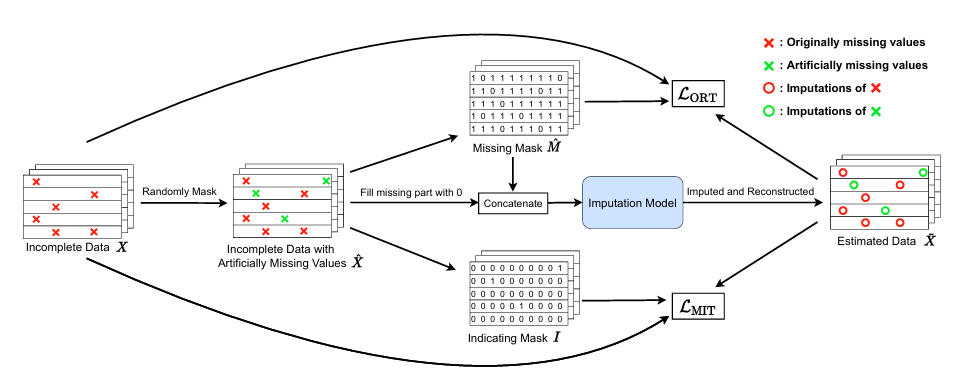

# Task02 -- 📘 SAITS: Self-Attention-based Imputation for Time Series 阅读笔记

## 1️⃣ 文章基本框架

### 背景以及核心相关文献

| 序号 | 论文标题                                        | 使用模型                               |
| -- | ------------------------------------------- | ---------------------------------- |
| 1  | BRITS: Bidirectional RNN Imputation         | Bi-RNN                             |
| 2  | GP-VAE: Gaussian Process VAE                | VAE + GP                           |
| 3  | NRTSI: Non-Recurrent Time Series Imputation | Transformer Encoder + Nested Loops |

### 目的

提出一种高效、非递归的自注意力机制模型 SAITS，用于多变量时间序列的缺失值填补（imputation）。目标是提高填补精度、加快训练速度、减少对复杂假设的依赖，同时支持在真实世界数据中有效运用。

### 结论

*   SAITS 显著优于现有主流方法（如 BRITS、Transformer）在多个公开数据集上取得 SOTA。
*   相较 Transformer，SAITS 参数更少、计算更快，结构更高效。
*   SAITS 提出的联合训练方法（Joint-Optimization of Imputation and Reconstruction）适用于多种模型，不局限于 SAITS。
*   在下游任务如分类上，SAITS 的填补提升了性能，验证其实用性。

***

## 2️⃣ 结果与讨论

### 数据以及数据来源

| 数据集名称          | 来源 & 特点                      |
| -------------- | ---------------------------- |
| PhysioNet-2012 | ICU 病人数据，极度稀疏（80% 缺失）        |
| Air-Quality    | 北京12个监测点的空气质量数据，轻微缺失（1.6%）   |
| Electricity    | 370个客户的用电数据（无缺失），人为设置缺失率进行对比 |
| ETT            | 变压器温度数据，无缺失，滑窗采样构建样本         |

### 实施

*   提出两种任务联合优化（ORT + MIT），在训练中模拟缺失值以增强泛化
 
输入带有**自然缺失**的数据X，然后经过随机掩码，制造**人工缺失**。之后使用两种掩码，分别对应**两种loss**：观测值的重建损失（loss of ORT）和人工缺失插值损失（loss of MIT），设计这两种loss的目的在于：MIT 被用于迫使模型尽可能准确地预测缺失值，而 ORT 则被利用来确保模型收敛于观察到的数据分布（MIT is utilized to force the model to predict missing values as accurately as possible, and ORT is leveraged to ensure that the model converges to the distribution of observed data.）。

由此可知，val\_X\_ori为原始数据，只带有自然缺失，而val\_X则为随机掩码后的数据，带有自然缺失和人工缺失，目的是计算模型针对人工缺失值给出的预测值与真实值的MAE，从而挑选模型。test\_X\_ori和test\_X的关系也是这样，test\_X\_ori用于计算最后训练得到的模型对于人工缺失值的预测性能。

*   所有模型统一超参数搜索，早停策略一致

### 评价方法

*   MAE（平均绝对误差）
*   RMSE（均方根误差）
*   MRE（平均相对误差）
*   下游任务：ROC-AUC / PR-AUC / F1 score（PhysioNet 数据上）

### 结论

*   SAITS 在所有数据集和不同缺失率下都取得最佳性能，提升幅度明显（如 MAE 可下降 11%+）
*   SAITS 在训练效率上优于 BRITS 和 VAE 类模型
*   Ablation 实验证明 DMSA（对角 Mask）和权重组合机制对性能至关重要

***

## 3️⃣ 文章亮点思考

> **优点：**
>
> *   首次将 Transformer 中自注意力机制以非递归方式用于缺失值填补，并设计对角 Mask 解决信息泄漏问题
> *   联合训练框架（ORT+MIT）合理平衡填补准确性与重建能力，理论分析充分
> *   模型轻量，参数少于 Transformer 和 BRITS，速度快，推广性强
> *   代码开源，实验设置严谨，结果具备可复现性

> **缺点：**
>
> *   主要关注 MCAR 类型的缺失，未深入研究 MNAR 情况
> *   在部分极端缺失场景下（如 90% 缺失）性能下降趋势未深入分析
> *   当前结构是“硬编码”的两层 DMSA，未来是否可更自适应或动态化还有待探讨

> **改进建议：**
>
> *   进一步探索 SAITS 在 MNAR、MAR 情况下的适应能力
> *   加入动态层数或 gated attention 控制 DMSA 叠加深度
> *   对于带时间戳或不规则采样的时间序列，可引入时间编码增强建模能力

***

## 4️⃣ 借鉴学习

### 思路

*   **联合训练思想：** 将 reconstruction 和 imputation 分开训练难以提升填补能力，需加入强制预测缺失值的任务。

*   **对角 Mask：** 有效避免 attention 自己看自己Self-Attention 的关键在于：

 $$ A = \text{Softmax} \left( \frac{QK^T}{\sqrt{d_k}} \right) $$

 注意力权重矩阵 $A \in \mathbb{R}^{T \times T}$ 表示每个时间步 $t_i$ 对所有时间步 $t_j$ 的关注程度。在标准自注意力中，$t_i$ 默认是可以“看到自己”的，也就是说，注意力矩阵 $A$ 的对角线（$i = j$）元素通常非零。

这在填补缺失值的任务中是不合理的：模型在预测当前时间步时，不应该“偷看”当前值本身。

🔒 对角 Mask 的作用
对角 Mask（Diagonal Mask） 就是人为地将注意力矩阵中的对角线屏蔽掉（设为 $-\infty$），使 softmax 后这些位置的权重变为 0，强制模型只能利用上下文（前后时间步）来推断缺失值。
DiagMask(x)[i, j] = {
    -∞     if i == j  (即对角线上的元素)
    x[i,j] otherwise
}

DMSA(Q, K, V) = Softmax( DiagMask(QKᵀ / √dₖ) ) ⋅ V

    $$
    \text{DMSA}(Q, K, V) = \text{Softmax}(\text{DiagMask}(QK^T / \sqrt{d_k})) \cdot V
    $$

    这样就能 **强制模型不能“用自己预测自己”**，只允许参考其他时间点的信息来填补缺失值。

*   **双阶段建模+动态权重融合：** 利用两个 DMSA 块生成不同层次表示，最后加权组合更健壮。**“双阶段建模 + 动态权重融合”**，是指 SAITS 中利用两个不同的自注意力模块（DMSA Blocks）分别学习不同的特征表示，然后通过一个可学习的权重机制，将这两个表示动态融合，得到最终的缺失值预测。***## 🎯 为什么要“双阶段建模”？单个 Transformer 层可能学习不到足够复杂的关系，尤其在时间序列中，缺失值往往需要 **同时建模时间依赖和变量之间的相关性**。所以作者采用了两个 DMSA（Diagonally Masked Self-Attention）Block：

    1.  **第一阶段（第一 DMSA Block）**：从原始输入中建模特征间关系，并初步填补缺失值。
    2.  **第二阶段（第二 DMSA Block）**：接收上一步填补后的数据，进一步优化填补结果。

    ***## 🔁 那为什么还要“动态权重融合”？这涉及一个非常重要的现实问题：> 第二阶段的填补并不总比第一阶段好，有时甚至退化。因此作者没有直接使用第二阶段的结果，而是**引入一个加权融合机制**，动态决定每个位置到底该“更信第一阶段”还是“更信第二阶段”。

    ### 📐 公式结构如下：

    $$
    \tilde{X}_3 = (1 - \eta) \odot \tilde{X}_1 + \eta \odot \tilde{X}_2
    $$

    其中：

    *   $\tilde{X}_1$ ：第一阶段填补结果（Learned Representation 1）

    *   $\tilde{X}_2$ ：第二阶段填补结果（Learned Representation 2）

    *   $\eta \in (0,1)^{T \times D}$ ：每个位置的可学习融合权重

    *   $\tilde{X}_3$ ：融合后最终的填补结果

    注意：这个权重 $\eta$ 是通过 self-attention 的 attention map 和缺失 mask 一起喂进一个小网络算出来的。***## 🎬 类比理解（打补丁）：你修一张照片，第一遍你大概补好了（模糊了背景噪点），然后你再细修了一遍（锐化人脸）。\
    最后你要判断：每一块地方到底用第一遍的模糊好，还是第二遍的锐化好？\
    于是你做了一个**加权融合**，每一块自动决定用哪个版本权重高一点。***## 📊 动态融合机制的意义：

    | 优点   | 说明                          |
    | ---- | --------------------------- |
    | 适应性强 | 每个时间点每个变量都有自己的一对融合权重        |
    | 避免退化 | 第二阶段可能并不总是更好，所以不能盲目信任       |
    | 参数高效 | 融合只用一层线性+Sigmoid 生成权重，计算量很小 |

### 问题：

*   SAITS 的架构是否能适配实时流数据填补？
*   对比 Diffusion 模型（如CSDI）在不规则采样和大缺失率下是否更具优势？
